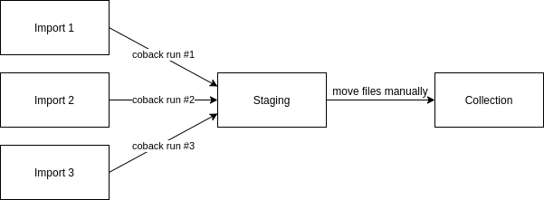

# coback


[](https://travis-ci.com/mitro42/coback)
[](https://goreportcard.com/report/github.com/mitro42/coback)
[](https://codecov.io/gh/mitro42/coback)

Leave no file behind! Make no decision twice!

Coback is a simple tool to consolidate your backups and save you some headache.

## TL;DR

1. run coback

```bash
$ coback /path/of/folder-to-import /path/of/staging-folder /path/of/collection
```

2. Move the files you need from staging to collection, delete what you don't want
3. Select a new folder-to-import and GOTO 1

## The Problem

For years I struggled to keep my photo collection organized. I never had a single location where I knew for sure that all my photos and videos were there. Some of my albums were backed up in many places where some of them were lying forgotten in some folder like G:/backups/from_drive_E/temp/backup/photos... waiting to be found again.

My collection spread out over dozens of hard drives, CDs, DVDs, SSDs, memory cards and USD sticks. I tried to sort out the mess many times but always stopped halfway through for some reason, and I ended up in a worse situation because now I had yet another copy of some of my files, but not all of them.

## The Tool

I needed a tool to solve this, so I designed CoBack. The main guiding requirements were these:

- Should be easy to use yet powerful enough to solve the problem

  This one is pretty obvious.

- I don't want to make decision about a file twice

  If I've already seen a photo and placed it in my collection, the tool should just ignore it in the future and not bother me with it again.
  If I've deleted it the same. The tool should know that I don't want to keep that file.

- Resumable process

  I knew that even with the tool organizing the collection will take a long time. There will be interruptions, change in priorities, life in general. I wanted a tool that makes it trivial to pick it up where I left off, no matter if I was interrupted for just a minute or in a coma for two years.

- I don't want to be restricted in what can I do with my collection when I'm not using the tool.

## How it works

CoBack is a very simple to use command line tool. It analyzes the folders you give it and copies the files you haven't seen yet to a new location. From there you put the files you want to keep to your collection and delete the rest. Then repeat with a new folder until you're done.

## How to use



There is only one way CoBack can be run. From the command line run it with three parameters:

```bash
$ coback /path/of/folder-to-import /path/of/staging-folder /path/of/collection
```

- **/path/of/folder-to-import** - this is the folder that you want to include in your collection
- **/path/of/staging-folder** - this is temporary folder that contains the files you have to do something with
- **/path/of/collection** - this is the location of your collection, where all your files should end up

CoBack will recursively scan all three folders and create a catalog file (called `coback.catalog`) in each of them. After this it will copy all 'new' files from the import folder to the staging folder.
Apart from creating the catalog in import and collection, CoBack will only ever do read operations in these folders. A 'new' file in this context is any file that is not present in the collection or staging folders and that was not copied to staging and deleted by the user in previous runs.

When CoBack is done, simply go through the contents of the staging folder, and move the files you want to keep to the collection. Delete the files you don't want to see anymore.

You can either finish this step completely or import a new folder with CoBack. Repeat for each folder that contains files you want to import.

If for whatever reason you have to stop, next time you want to continue, just simply open the staging folder and keep moving/deleting the files. If the staging is empty (or you forget where you put it or your cat jumped on the keyboard and deleted it) just start importing folders again.
If you run CoBack on a folder that was already completely imported you should get a new folder in the staging folder with no files in it.

The general idea is that it should be safe to do anything with your collection between runs, and using CoBack is just one of three steps: running the tool, moving files from staging to the collection and deleting files you don't need.

** Important ** Do not change any files in any of the three folders while CoBack is running!

## QNFABUKA (Questions Not Frequently Asked But Useful to Know the Answers to)

- Is it only for photos and videos?

  No, of course not. This is what it was designed for and what it was mostly tested with. But for CoBack the files are just series of bytes, it doesn't matter if they are photos, PDFs, MP3s or other.

- What similarity measures are used?

  CoBack only uses bitwise comparison and md5 sums. So if two files contain the same image but have a slightly different white balance, or were just simply saved with different compression settings will be treated as completely different files. This is a major limitation of the tool now and would be nice to fix in the future.

- Can I modify the collection, move files around and rename them?

  **While CoBack is running: No, don't touch it!**

  Otherwise yes, next time CoBack runs it will rescan the folder and update the catalog with your changes.

- Can I do the same in staging?

  **While CoBack is running: No, don't touch it!**

  Otherwise it shouldn't be a problem, but it's probably better if you stick with the intended use, and only delete files or move them to the collection.

- Can I delete files from my collection?

  **While CoBack is running: No, don't touch it!**

  Otherwise yes, next time CoBack runs it will rescan the folder and update the catalog with your changes.

- What happens if a run of CoBack is interrupted?

  Just re-run the tool with the same parameters and it will continue the scan where it was interrupted. While CoBack is running the catalog is updated every few seconds, so it will rescan only what was not yet written to the files.

- What happens if an import folder contains duplicates?

  Normally CoBack will hide it from you if it comes across any duplicates, however this case is an exception. If an imported folder has duplicates all of them will be copied to the staging.
  The reason for this is the case where you have a large number of photos in an album (all the photos you've taken on a holiday), and a smaller selection of them you want to put on social media. You already spent time to select those photos, the tool shouldn't throw them away. If you don't need them, just delete them as other files.

  If the smaller selection is imported in a separate run, they of course won't be copied to the staging.

- Can I create duplicates in my collection?

  **While CoBack is running: No, don't touch it!**

  Otherwise duplicates in collection are fine.
